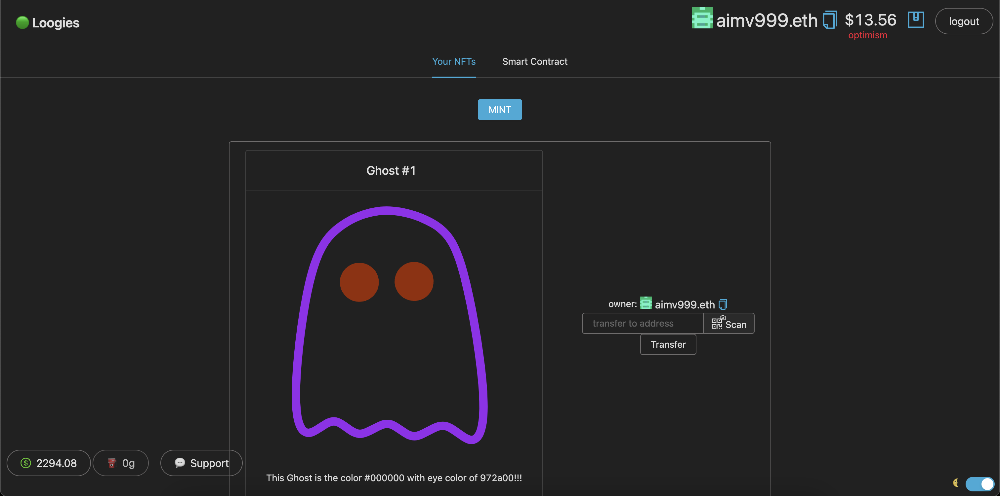

# 🏗 scaffold-eth - 🔵 Ghosts (Loogies) SVG NFT

Demo: https://ghosts-svg-nft.surge.sh/

## About the Project

<p align="center">
  
</p>


## Prerequisites

This branch is an extension of [loogie-svg-nft](https://github.com/scaffold-eth/scaffold-eth/tree/loogies-svg-nft) branch (watch its [demo](https://www.youtube.com/watch?v=m0bwE5UelEo) to understand more about it).

[Node](https://nodejs.org/en/download/) plus [Yarn](https://classic.yarnpkg.com/en/docs/install/) and [Git](https://git-scm.com/downloads)

## Getting Started

### Installation


```bash
git clone https://github.com/AzimovS/ghosts-svg-nft

cd ghosts-svg-nft

git checkout loogies-svg-nft
```

```bash

yarn install

```

```bash

yarn start

```

> in a second terminal window:

```bash
cd ghosts-svg-nft

yarn chain

```

---

> in a third terminal window:


```bash
cd ghosts-svg-nft

yarn deploy

```

📱 Open http://localhost:3000 to see the app

